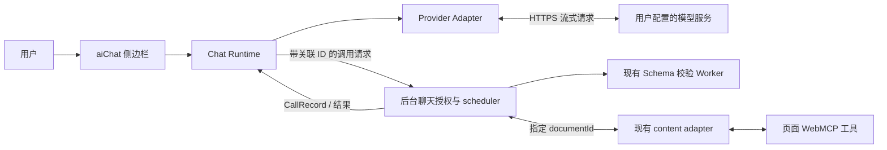

# aiChat 可行性评估与开发设计

日期：2026-09-18  
状态：首版协议与本地闭环已实现（0.2.1），真实供应商待验收；本文保留设计依据，实际结果见 [AIChat 测试报告](ai-chat-test-report.md)。  
目标：用户在插件中配置模型服务、API Key 和模型，通过侧边栏对话，让模型调用已授权的当前页面 WebMCP 工具。

## 1. 评估结论

**可以实现，建议在现有 Chrome MV3 侧边栏中新增 aiChat 入口。** 当前项目已具备工具发现、参数校验、执行调度、文档锁及结果回传，新增工作主要是模型接入、对话编排和 AI 调用授权，不需要重建页面执行器。

推荐首版采用：**侧边栏运行模型对话循环并直接请求模型 API，后台复用现有 scheduler 执行页面工具。** 内置 aiChat 不依赖 `webmcp-server`；原有远程 MCP 共享功能继续服务外部 AI 客户端。

成立条件：

- 页面必须注册插件目前支持的 WebMCP 工具，浏览器须提供对应原生接口。仅填写 API Key 不能让普通网页自动变成可操作页面。
- 所选模型和接口必须支持 function calling/tool use；仅支持文本生成的模型可聊天，但不能启用页面工具。
- 扩展需要获得业务站点和模型 API 站点的访问权限，供应商端点也须接受该请求方式。
- 用户知悉选中的工具定义、聊天内容和工具结果将发送到配置的模型服务。API Key 属于用户自己，不能把平台公共密钥打包到扩展中。
- 首版对话编排随侧边栏生命周期运行；关闭侧边栏停止后续模型请求，已经发出的页面操作可能仍会完成。

可行性判断来自代码与官方文档核对，**尚未使用真实供应商 API Key 做联网、计费或模型效果验收**。自定义网关、浏览器直连和具体模型能力须按第 12 节验证。

## 2. 当前代码基础与缺口

下列路径均相对插件仓库根目录；`ui/`、`background/`、`content/` 缩写以 `apps/extension/src/` 为基准。

| 模块                            | 已有能力                                                                       | aiChat 所需改动                                                     |
| ------------------------------- | ------------------------------------------------------------------------------ | ------------------------------------------------------------------- |
| `apps/extension/src/ui/App.vue` | Vue 3 侧边栏，工具、历史、设置、共享视图                                       | 增加 aiChat 和模型设置入口；根组件保留组装职责                      |
| `ui/composables/panel.ts`       | `View` 联合类型、当前标签页监听、站点授权                                      | 增加 `chat`、`model-settings`；聊天目标不能直接跟随响应式当前页漂移 |
| `ui/composables/bridge.ts`      | Port 请求、ACK、Snapshot、30 秒响应等待                                        | 新增有返回值的请求接口，关联 `callId`；ACK 不代表执行完成           |
| `background/scheduler.ts`       | Schema 校验、权限复查、目录版本校验、每文档单调用锁                            | 增加 `aiChat` 调用上下文、去重、授权复查和调用 ID 返回              |
| `background/state.ts`           | 超时、后续返回、历史裁剪                                                       | 保持“结果未知”语义，提供 AI 结果消费状态                            |
| `background/index.ts`           | 可信侧边栏 Port 校验、状态持久化、导航失效、结果接收                           | 接入聊天授权、调用关联查询、取消未提交任务、会话所有权              |
| `content/index.ts`              | `document.modelContext.getTools()` / `executeTool(tool, JSON.stringify(args))` | 首版沿用，模型不可绕过它执行任意代码                                |
| `packages/protocol/index.ts`    | Zod 命令、`PageTool`、`CallRecord`、`Snapshot`                                 | 新增聊天命令与类型，`source` 扩展为 `manual \| agent \| aiChat`     |
| `apps/extension/manifest.json`  | `sidePanel`、`storage`、按需 HTTP/HTTPS host 权限                              | 通常无需新权限类别；新增模型域名授权逻辑                            |
| `scripts/build.mjs`             | Vite 构建侧边栏，esbuild 构建后台和适配器                                      | 新前端模块可随现有构建打包，不加载远程脚本                          |
| 相邻 `webmcp-server` 项目       | MCP 与浏览器之间的轻量桥接                                                     | 推荐方案首版无需修改                                                |

现有边界必须继承：

- 单工具参数最大 256 KiB，页面结果序列化最大 1 MiB；工具目录最多 200 项。
- 默认页面调用期限 60 秒；超时标记 `unknown`，不会自动重试或直接解除锁。
- 历史最多 100 条、调用载荷预算 6 MiB；旧参数和结果可能被释放。
- 页面刷新、导航和工具目录变化会使旧目标或旧版本失效。
- 当前 `invoke()` 返回 `Promise<void>`，普通调用 ID 在 scheduler 内生成，现有 ACK 不携带 ID。不能按“最近一次同名工具调用”猜测 AI 结果。
- 当前工具结构不包含可信的“只读/写入”分类，不能仅凭名字或描述判断是否安全。

## 3. 首版范围

### 3.1 用户流程

1. 打开侧边栏，点击「AI 对话」。
2. 首次进入时添加模型配置：配置名称、协议、Base URL、模型 ID、API Key、密钥保存方式。
3. 点击「测试连接」，申请准确的 API 域名权限；发送最小无业务数据请求，提示可能产生少量费用。
4. 选择当前页面，授权站点访问，展示已发现的工具及不可用原因。
5. 模型与页面就绪后默认授权全部兼容工具，其定义和结果可发往所选服务；可展开授权区域调整范围。超出 30 个工具或 128 KiB 定义预算时提示缩小范围，不静默截取。
6. 发送任务；展示流式回答、工具调用参数、执行状态和结果摘要。
7. 默认自动执行已授权工具；可切换逐次确认或撤销。主动撤销后本会话不自动恢复授权。
8. 可停止生成、清空会话、查看原始调用记录或创建新会话。

### 3.2 首版交付

- 多份模型配置；每份配置绑定协议、端点、模型和凭证。同一供应商可配置多个模型或 Key。
- 首先交付 OpenAI Chat Completions 兼容协议，允许用户手填模型 ID；“兼容”需要端点实测，不能据此承诺所有厂商可用。
- 文本流式对话、串行工具执行、多轮工具结果回传、停止、错误提示。
- 当前顶层页面工具授权、参数确认、调用记录关联。
- 浏览器会话内聊天记录；默认不跨浏览器重启保存聊天内容。
- 不支持工具的模型可切换为纯聊天模式；页面不支持 WebMCP 时也可纯聊天。

### 3.3 后续扩展

独立适配 OpenAI Responses、Anthropic Messages、Gemini 原生协议；按真实 Key 联调后逐项发布。跨标签页任务、后台持续执行、附件与图片、长期历史、企业密钥代理均放在后续迭代。

这里的“页面工具”指页面注册的 WebMCP 能力。自动点击任意 DOM、截图理解、浏览器全局控制和模型生成 JavaScript 执行不属于本方案首版。

## 4. 架构选择

| 方案                                | 优点                                                       | 代价                                                     | 判断                    |
| ----------------------------------- | ---------------------------------------------------------- | -------------------------------------------------------- | ----------------------- |
| A：侧边栏直连模型，后台执行页面工具 | 无需部署；复用现有插件；流式运行不依赖 Service Worker 常驻 | Key 会进入受信任扩展上下文；关闭侧边栏会中断编排         | 推荐首版                |
| B：后台 Service Worker 运行完整对话 | UI 与运行逻辑分离                                          | 必须处理休眠、慢请求、中断恢复；打开 Port 不等于永久存活 | 不作为首版              |
| C：服务端代理模型并编排             | 可统一密钥、审计与长期任务                                 | 新增部署、认证、隔离、日志及数据处理责任                 | 企业/后台任务场景再采用 |

Chrome 对扩展 Service Worker 有生命周期限制，需要设计为可被终止和恢复，因此不能依赖其持续运行长时间对话。[Chrome 官方生命周期说明](https://developer.chrome.com/docs/extensions/develop/concepts/service-workers/lifecycle)



模型只提出工具名和参数，真正的执行由插件完成。这与 function calling 的客户端执行模式一致。[OpenAI Function calling](https://developers.openai.com/api/docs/guides/function-calling)

**进程职责：**

- 侧边栏：用户交互、模型请求、流式解析、对话循环、供应商协议上下文；由根级 `useChatRuntime()` 持有，切换侧边栏内部视图时不销毁运行实例。
- 后台：工具执行与本地聊天授权的最终裁决、调用锁、持久调用关联和结果；不接收模型任意指定的网络 URL。
- content adapter：仅执行已校验的页面工具，不读取 Key、不请求模型。
- 现有 offscreen/Worker：继续做 Schema 校验，不为保活聊天复用 offscreen。
- 远程 MCP 桥接：保持独立；远程 `SET_SHARING` 不构成本地 aiChat 授权，二者不能隐式互相开启。

## 5. 多模型接入

### 5.1 配置模型

以下为设计类型，不代表当前已实现。

```ts
type ProviderProtocol =
  'openai-chat-completions' | 'openai-responses' | 'anthropic-messages' | 'gemini';

interface ModelProfile {
  id: string;
  name: string;
  protocol: ProviderProtocol;
  baseUrl: string;
  model: string;
  credentialId: string; // 不内嵌 API Key
  keyStorage: 'session' | 'local';
  capabilities: {
    tools: 'untested' | 'supported' | 'unsupported';
    streaming: 'untested' | 'supported' | 'unsupported';
  };
  maxOutputTokens?: number;
}
```

Key 通常属于供应商账号/项目，并非每个模型必定单独签发。配置层允许不同模型共用 credential，也允许分别填写。

端点按协议拼接：例如兼容配置 `https://gateway.example/v1` 加 `/chat/completions`，不能统一追加 `/v1`。校验 HTTPS、URL 用户名/密码、query、fragment 和重复路径；首版仅允许明确配置的 loopback HTTP 作为本地模型开发入口。任意请求重定向默认拒绝，换端点后重新授权并要求重新选择/输入凭证，不把原 Key 自动发送到新主机。

### 5.2 适配器契约

适配器向编排器暴露统一事件：`text_delta`、`tool_call_delta`、`tool_call_complete`、`usage`、`completed`、`error`。每项工具请求包括 `providerToolCallId`、工具别名和原始参数。仅在完整响应确认工具调用完成后，才解析参数、校验并提交执行，不能执行半截流式 JSON。

统一展示层与供应商原生上下文分离：消息用于 UI；`providerState` 保存本轮原始结构化内容、推理条目或签名等协议必须字段，按供应商规则回传。不能把所有结果压成一段 assistant 文本后继续对话。

| 协议                         | 工具请求与结果的处理                                                         | 发布要求                                          |
| ---------------------------- | ---------------------------------------------------------------------------- | ------------------------------------------------- |
| OpenAI Chat Completions 兼容 | `tools` / assistant `tool_calls`；每个 `tool_call_id` 对应 `role: tool` 结果 | 首版；聚合 delta，保留 assistant 工具请求消息     |
| OpenAI Responses             | `function_call` 与 `function_call_output`，按 `call_id` 关联                 | 单独适配；保留继续推理所需 output items           |
| Anthropic Messages           | `tool_use` content block 与 `tool_result`                                    | 单独适配；遵守 block 顺序、关联 ID 和错误结果格式 |
| Gemini                       | `functionCall` 与 `functionResponse`                                         | 单独适配；保留模型要求的原生 parts/签名和关联信息 |

各协议不能只替换 URL 和请求头。实现依据：[OpenAI 工具协议](https://developers.openai.com/api/docs/guides/function-calling)、[Anthropic 工具定义](https://platform.claude.com/docs/en/agents-and-tools/tool-use/define-tools)、[Gemini Function calling](https://ai.google.dev/gemini-api/docs/function-calling)。

首版可以使用原生 `fetch` + SSE 解析器，减少 SDK 对浏览器环境的限制和包体积。SDK 若默认禁止浏览器使用，不能把关闭保护误认为已解决密钥暴露。Anthropic SDK 的浏览器限制及选项应在接入时核对。[Anthropic 官方 TypeScript SDK](https://github.com/anthropics/anthropic-sdk-typescript)

### 5.3 工具定义适配

- 对用户已选且 `executable` 的工具建立不可变快照：`pageId + documentId + catalogVersion`。
- 工具别名使用 `webmcp_0001` 等短 ASCII 标识；保存别名到原始工具名的映射，避免原工具名超长、字符不兼容或冲突。
- 每个协议对 JSON Schema 支持范围独立检查；可无损适配的转换，不支持的工具标记“当前模型接口不兼容”。不能静默删除约束，也不能宣称任意 JSON Schema 通用。
- 不强制开启所有接口的 strict 模式；该模式可能改变必填字段等要求。模型生成参数最终仍用现有原始 Schema 校验。
- Schema 引用不得触发任意网络拉取；描述和 Schema 视为页面提供的不可信内容。
- 首版每会话最多选择 30 个工具，序列化工具定义预算建议 128 KiB；超限提示减少选择，不悄悄漏传。实际预算还应小于所选模型上下文上限。

## 6. 调用协议与对话循环

### 6.1 必须新增的关联信息

```ts
interface ChatCallContext {
  sessionId: string;
  runId: string;
  invocationId: string; // 插件为一次逻辑执行生成的 UUID
  providerToolCallId: string; // 仅用于模型协议关联，不直接作为后台主键
  grantId: string;
}

interface ChatTarget {
  pageId: string;
  documentId: string;
  catalogVersion: string;
}
```

建议扩展命令：

| 命令                  | 输入                                            | 返回/用途                                            |
| --------------------- | ----------------------------------------------- | ---------------------------------------------------- |
| `CREATE_CHAT_GRANT`   | session、目标、工具列表、执行模式、profile 版本 | 后台生成 `grantId`，绑定可信 Port 所有者             |
| `REVOKE_CHAT_GRANT`   | `grantId`                                       | 阻止新调用和未提交操作，停止新增结果外发             |
| `APPROVE_CHAT_CALL`   | grant、invocation、工具、参数摘要               | 单次批准令牌，绑定实际参数内容，消费一次             |
| `CHAT_INVOKE`         | 聊天上下文、目标、工具原名、arguments、批准令牌 | 调度接受/拒绝；接受返回 `callId`                     |
| `GET_CHAT_INVOCATION` | session、invocation                             | 查询是否已创建调用及最终状态，断线后不得盲目重发     |
| `CANCEL_CHAT_RUN`     | session、run                                    | 标记停止，阻止尚未送达页面的操作；不能撤销已送达操作 |
| `READ_CHAT_RESULT`    | session、invocation                             | 复核当前授权，返回受限结果并保留消费记录             |

`bridge.command()` 现有 `Promise<void>` 可保留，新增泛型 `request()` 处理上述有返回值的命令。`CHAT_INVOKE` 的响应只代表提交状态；完成由关联 `CallRecord` 以及查询接口确认。不得使用 30 秒 ACK 等待器等待完整模型任务。

后台 scheduler 接受显式上下文联合类型 `manual | remoteAgent | aiChat`，替代以 `agent` 是否存在来推断来源的单一逻辑。沿用现有调用锁，在参数校验后、持久化后和真正发送前复查聊天授权、取消状态、目标及目录版本。

### 6.2 幂等与竞争

- 去重键为 `sessionId + invocationId`，绑定目标、工具和参数摘要；同键不同内容必须拒绝。
- 使用后台串行提交或原子式内存临界区，避免多个异步校验结束后都创建同一调用。
- 在发送到页面前持久化调用关联与状态；重启后查询原调用，不重新执行。
- 关联表与调用记录同一持久化事务边界管理。调用载荷裁剪后保留去重墓碑，直到会话结束/安全过期；已释放结果返回 `RESULT_RELEASED`。
- 同一会话只能有一个运行所有者；第二个侧边栏只能查看或先显式接管。后台重启/Port 断开后新执行授权失效，重新进入时先核实旧调用再恢复。
- 手动调用、远程 Agent 和 aiChat 共用同一文档锁。`PAGE_BUSY` 显示等待/稍后继续，不建立无限自动重试队列。

### 6.3 单轮流程

1. 冻结 profile 版本、目标、工具映射、授权和本轮用户输入；每次运行分配 `runId`。
2. 组装系统指令、允许发送的历史和工具定义，请求模型。
3. 流式展示文本；仅完整的工具请求进入解析。无工具请求则正常完成。
4. 工具名必须命中冻结映射；参数必须为普通 JSON 对象，满足大小限制及原始 Schema。
5. 默认自动执行本次授权集合中的工具。切换逐次确认后展示工具、目标站点及实际参数，获得批准后执行。
6. 提交 `CHAT_INVOKE`，得到后台 `callId`，观察该调用完成。
7. 将授权仍有效的结果按限制与脱敏规则转换为模型工具结果；明确区分业务错误、执行失败、结果未知和内容截断。
8. 回传结果，请求下一轮模型回答；直到完成、用户停止、达到上限或出现须人工处理的状态。

模型一次提出多个工具请求时按返回顺序串行执行；即使接口声称支持并行，也不能绕过每文档单调用锁。回传下一轮前为该批每个工具 ID 提供结果或结构化拒绝结果，不能留下悬空工具消息。

建议首版默认上限：每条用户消息最多 8 次模型请求、10 次工具执行，总运行 5 分钟；模型请求 30 秒首字节超时、30 秒流空闲超时、120 秒总时限，均作为可调整应用策略。页面执行保持当前 60 秒语义。达到上限停止并说明已完成步骤；不自动开启新一轮绕过上限。

### 6.4 状态机与停止语义

```text
idle → requesting_model → awaiting_approval → executing_tool
                         ↑                      ↓
                         └── requesting_model ← tool_result

任意状态 → completed / stopped / failed / interrupted
执行状态不确定 → blocked_unknown
目标或目录失效 → paused_target_changed
```

- 「停止」立即 abort 模型网络请求，后台标记 run 停止；后续 delta、批准和新调用均忽略。
- 已送达页面的调用仍可能执行；显示“已停止后续步骤，页面操作仍在执行/结果未知”，最终结果保留于调用历史。
- 停止与发送发生竞争时，以后台实际 delivery 状态为准；不能宣称回滚。
- 侧边栏关闭/崩溃/刷新：编排中断，旧授权失效。重新打开恢复记录但不自动续跑；先查询在途调用。
- Service Worker 重启：沿用现有 `STATUS` 核实机制；聊天映射恢复，执行授权需要重新建立。
- 切换浏览器标签页：显示“聊天仍绑定原页面”；不会自动把调用转到新标签页。切换聊天目标需停止当前运行并新建会话。
- 原页面导航、SPA 目录更新或工具重注册：暂停运行，旧确认和映射失效；重新发现、重新授权后由用户继续。
- 原页面在执行中导航：工具可能已产生副作用但无结果；保留未知状态，不自动重做。
- 迟到结果更新原调用卡片，不自动重启已停止的聊天循环。

## 7. API Key、授权与数据发送

### 7.1 密钥存储

- 默认 `chrome.storage.session`；明确启用“记住 API Key”才写 `chrome.storage.local`。两个区域均设置 `TRUSTED_CONTEXTS`，不使用 `storage.sync`。
- profile 与 credential 分开保存；列表仅展示“已设置”和脱敏末尾字符，密钥不进入 Snapshot、CallRecord、聊天消息、远程共享协议和日志。
- 直连架构下，侧边栏可信请求模块需要读取 Key 并放入协议规定的认证头；“不出浏览器”不适用于调用模型 API，Key 必须发送给选定供应商。
- `storage.local` 不是操作系统密钥保险箱，不承诺加密保管；设备/扩展上下文被攻破时无法保证凭证安全。后续如需静态加密，使用用户口令派生密钥，不能把解密密钥与密文一起保存。
- 删除配置时停止其运行，删除无其他配置引用的 credential；支持单独清除所有 Key。

Chrome 官方说明了 session 的内存生命周期、local 的持久性、默认可见范围及 `setAccessLevel()`。本方案利用这些能力隔离 content script，不将其描述为硬件级凭证保护。[Chrome Storage API](https://developer.chrome.com/docs/extensions/reference/api/storage)

### 7.2 网络与域名权限

从扩展侧边栏而非 content script 发起跨域请求；在用户点击连接测试/授权时申请准确 API origin 的 host 权限。现有 optional host permissions 已覆盖 HTTP/HTTPS，当前 CSP 允许 HTTPS 与指定 loopback HTTP。权限许可不保证供应商认证、风控或网关兼容性，应分别诊断。[Chrome 跨域请求说明](https://developer.chrome.com/docs/extensions/develop/concepts/network-requests)

请求使用 `credentials: 'omit'`，不携带业务站点 Cookie。API URL 只能来自用户配置；模型输出、页面描述和工具返回不可改变端点或请求头。删除模型配置时移除该配置的应用授权；浏览器 host 权限须检查是否还被业务站点或其他配置使用，不能误删共享权限。

公开分发时采用 BYOK（用户自带 Key），不内置开发者 Key。需要隐藏组织凭证的产品应改用有认证的服务端代理，不能把浏览器端配置表单当作服务端密钥管理。Google 同样强调客户端暴露 API Key 的风险。[Gemini API Key 指南](https://ai.google.dev/gemini-api/docs/api-key)

### 7.3 执行授权

必须区分三件事：浏览器允许访问站点、用户允许向模型发送数据、用户允许执行工具。AIChat 默认选择全部兼容工具，但创建独立会话授权，不复用远程共享授权。

0.2.1 按已确认的交互要求默认全部授权并自动执行，授权与 profile、目标文档、目录版本和工具列表绑定。用户可调整范围、切换逐次确认或撤销；模型名称、描述或自报“只读”不能扩大范围或绕过用户选择的确认。主动撤销跨视图与重开保留，恢复记录先核查在途调用，不自动续跑或接管其他侧栏。撤销立即阻止未提交操作及新增结果外发；已发出的供应商请求或页面操作无法追回。

工具结果与描述均作为不可信数据，不得提升为 system 指令。系统提示要求忽略工具结果中的越权要求，但真正的边界由工具白名单、目标绑定及后台权限检查保证。

### 7.4 数据与渲染

- 默认仅发送用户消息、已选工具定义和授权工具结果；不主动读取整页 DOM、Cookie、浏览器存储或完整 URL query/hash。
- 页面上下文默认只附 origin，标题等内容由用户选择；跨站点新会话不继承上一站点工具结果。
- 单次给模型的工具结果建议限制为 64 KiB、每轮合计 128 KiB；使用结构化裁剪并附 `truncated`、`originalBytes`，不把截断字符串假装成完整 JSON。
- 本地原始结果沿用现有调用历史；结果过大或已释放时说明原因，不能为了取结果再次执行工具。
- 对常见敏感字段做可配置脱敏，但不能声称能自动识别所有业务敏感数据。用户可查看即将发送的内容范围。
- 用户正文按纯文本显示；智能体正文由本地打包的 markdown-it 渲染，禁用 HTML，图片仅显示替代文本，链接仅允许 HTTP/HTTPS 并使用新标签页及 noopener noreferrer。仅渲染安全解析器产物，不直接注入模型输出；聊天存储和模型上下文保留原始 Markdown。
- usage 缺失显示“供应商未返回”，不用猜测 token/费用；不内置未经维护的固定模型价格。
- 首次开启 aiChat 及 README/隐私说明须明确：聊天和已授权工具数据会经过所选模型服务；模型侧数据保留以该服务设置为准。

## 8. 会话与存储预算

聊天会话保存 `schemaVersion`、session/profile 标识、目标、UI 消息、供应商原生上下文、运行检查点和调用关联；不保存明文 Key。profile 修改后增加版本号，运行中锁定旧版本；切换协议/模型创建新会话，避免错误复用原生上下文。

现有调用载荷预算 6 MiB 不等于完整持久化 Snapshot 大小；当前 `persist()` 会清空持久化副本的 `page.tools`，但页面元数据、共享状态及新增聊天上下文仍需计入预算。不能再无条件给聊天分配几 MiB。建议设全扩展 `storage.session` 总软预算 8 MiB，聊天最多 1 MiB，并以实际序列化大小及 `getBytesInUse()` 检查剩余额度；不足时先裁剪旧完整聊天轮次和非在途结果，仍不足则拒绝新任务并提示清理。持久化失败不能继续发起页面副作用。

上下文裁剪保留完整的 assistant 工具请求及对应全部结果，不能拆散成孤立消息。存在在途工具时不裁剪相关上下文；模型 token 预算独立于存储字节预算，超过支持上限时提示新建会话。聊天清空与调用历史分开处理，存在在途操作时保留最小关联墓碑直到完成。

## 9. UI 与代码拆分

采用 Vue 3 Composition API、`<script setup lang="ts">`，与现有项目一致。状态由根级 runtime 持有，组件通过 props/emits 展示和发出意图。

| 建议新增模块                              | 单一职责与接口                                            |
| ----------------------------------------- | --------------------------------------------------------- |
| `ui/components/chat/AiChatView.vue`       | 对话布局；接收会话状态，发出 send/stop/newSession         |
| `ui/components/chat/ModelProfileForm.vue` | 配置表单、密钥输入；发出 save/test/delete，不保留日志副本 |
| `ui/components/chat/ChatMessageList.vue`  | 消息渲染与滚动；接收 messages                             |
| `ui/components/chat/ChatComposer.vue`     | 输入与发送停止；接收 busy，发出 send/stop                 |
| `ui/components/chat/ChatToolCallCard.vue` | 参数、结果和状态；发出 approve/reject/openRecord          |
| `ui/components/chat/ChatToolScope.vue`    | 显示绑定目标和工具选择；发出 grant/revoke                 |
| `ui/composables/chat.ts`                  | runtime 的 Vue 绑定与可读状态，控制根级生命周期           |
| `ai/chat-runtime.ts`                      | 与 Vue 无关的对话状态机、预算及停止逻辑                   |
| `ai/providers/*.ts`                       | 各供应商请求、流式解码、原生上下文转换                    |
| `ai/tool-catalog.ts`                      | 别名映射、Schema 能力检查、工具预算                       |
| `ai/credentials.ts`                       | 凭证读取、保存、删除和脱敏                                |
| `ai/chat-storage.ts`                      | 会话迁移、限额和原生上下文持久化                          |
| `background/chat.ts`                      | grant、run、所有权、幂等映射及结果读取                    |
| `packages/protocol/chat.ts`               | 聊天命令、事件、Zod 约束及共享类型                        |

除 protocol 外，上表路径以 `apps/extension/src/` 为基准。首版不必新增 Router、Pinia 或重型 Agent 框架；现有简单导航和 provide/inject 足够。

360px、420px 侧边栏都应可用；工具参数和长结果折叠显示。输入支持 Enter 发送、Shift+Enter 换行，并处理中文输入法 composition。流式消息避免逐 token 全量重绘/持久化，按短周期批量刷新，在完成消息和提交工具等关键节点落盘。

## 10. 错误处理约定

| 情况                         | 用户呈现                 | 后续处理                                            |
| ---------------------------- | ------------------------ | --------------------------------------------------- |
| Key 缺失、401/403            | 凭证或权限不可用         | 打开模型设置，不自动切换供应商                      |
| 429                          | 服务限流/额度问题        | 展示可安全提取的信息；首版用户手动重试模型请求      |
| 网络失败、SSE 中断           | 本轮响应中断             | 保留已确认内容，不执行不完整工具请求                |
| 参数解析/Schema 失败         | 展示具体字段错误         | 以结构化工具错误反馈，最多允许 2 次修正且计入总轮数 |
| 未授权/未知工具              | 工具不在允许范围         | 拒绝并记录，不进行模糊名称匹配                      |
| `PAGE_BUSY`                  | 页面有其他操作执行中     | 停止当前提交，用户确认状态后继续                    |
| `CATALOG_STALE` / 页面失效   | 页面或工具已变化         | 暂停，重新发现与授权                                |
| `EXECUTION_UNKNOWN`          | 操作可能已执行，结果未知 | 阻断自动循环，不重试该工具                          |
| `RESULT_RELEASED` / 过大结果 | 原始结果不可用/超限      | 提供事实错误，不重跑原操作                          |
| 业务错误                     | 工具已返回业务错误       | 保留结构化错误，禁止模型把它表述为成功              |
| 存储写入失败                 | 无法安全记录执行状态     | 发出副作用前拒绝；已发送的按未知结果处理            |

重新生成回答优先使用已有工具结果；不得把“重试回答”实现为重放整个工具执行流程。网络请求失败可能已产生模型计费，UI 不承诺免费重试。

## 11. 开发顺序与工作量

以下为一名熟悉当前代码的工程师的粗估，不是交付承诺；不含等待供应商开通或商店审核。

| 阶段           | 交付内容                                                     | 估算                         |
| -------------- | ------------------------------------------------------------ | ---------------------------- |
| P0 可行性验证  | 真实扩展直连一个兼容服务；最小工具闭环；慢流、权限及关闭验证 | 1–2 人日                     |
| P1 执行基础    | 调用 ID、grant、幂等、取消、所有权与恢复，保持手动/远程回归  | 3–4 人日                     |
| P2 可用 aiChat | 模型设置、Key、流式聊天、工具确认、上下文和错误处理          | 4–6 人日                     |
| P3 验收发布    | 单元/组件/浏览器测试、脱敏与配额验证、文档和打包             | 2–3 人日                     |
| 扩展协议       | 每新增一种原生协议及专用测试                                 | 约 1–3 人日/种，按复杂度调整 |

兼容协议 MVP 约 **10–15 人日**。先完成 P0；如端点不能直连，明确将该端点标为不支持，或另开代理方案设计，不把浏览器限制归咎于 API Key 错误。

## 12. 测试与验收

### 12.1 单元与组件测试

- Provider：SSE 数据帧跨 chunk、UTF-8 拆分、多工具 ID、参数增量、异常结束、usage 缺失、取消及完整终止判断。
- Catalog：中文/长名称、别名冲突、不支持 Schema、目录预算、未知别名拒绝。
- Scheduler：同 invocation 并发提交、重连、重启、裁剪后的去重；同 ID 不同参数拒绝。
- Grant：校验期间撤销、确认后参数替换、发送前停止、Port 断开、跨 session 盗用均被拒绝。
- Runtime：多个工具串行、工具失败修正上限、未知结果阻断、停止后迟到消息、原生上下文正确配对。
- 存储：迁移、配额不足、写入失败、session 清除及不记录 Key。
- Vue：配置增删改、工具勾选、流式状态、输入法、确认卡片、窄屏和键盘操作。

### 12.2 浏览器验收

扩展现有 fixture，使用本地可控模型假服务稳定复现请求/工具/结果循环；原生 WebMCP 仍在支持的测试浏览器验收，不用模拟替代真实页面执行链。

1. 配置两个模型，分别聊天并完成“查询订单 → 使用结果 → 总结”闭环。
2. 无站点权限、无 API 域名权限、无工具授权时均给出准确引导。
3. 未注册 WebMCP 的页面可纯聊天，但不会显示虚构工具。
4. 手动、远程和 aiChat 竞争同文档时，不发生并发页面执行。
5. 关闭/重开侧边栏、主动终止后台、刷新页面、变更目录、切换标签页不重复执行工具。
6. 验证 60 秒未知结果与后续返回；停止后不继续发模型请求。
7. 工具描述/结果含恶意指令、HTML、外部图片和伪造工具名时，不越权执行或泄露 Key。
8. 每个正式支持的供应商至少使用一次真实 Key 验证文本流、工具往返、错误分类和认证；记录 Chrome、接口、模型、日期和已知限制，不能仅凭假服务宣布兼容。

### 12.3 回归命令

```sh
npm run check
npm test
npm run build
npm run test:extension
npm run check:bridge-protocol
npm run test:browser
# 变更共享 scheduler 后，还需连接已构建的桥接服务验证原远程链路：
WEBMCP_BRIDGE_MODULE=/absolute/path/to/webmcp-server/dist/index.js npm run test:bridge-browser
```

开发时新增 `tests/chat-runtime.test.ts`、`tests/chat-provider.test.ts`、`tests/chat-scheduler.test.ts` 及聊天 UI 测试；浏览器 AI 假服务脚本另建，避免真实 Key 出现在测试源码或测试产物中。

发布门槛：上述关键流程通过，真实接口测试有记录，现有手动工具与远程桥接无回归；在工具结果未知时绝不自动重试。在没有真实供应商联调前，只能标记“协议实现完成/待验收”。

## 13. 实施决定

建议按 P0 → P1 → P2 → P3 推进。默认采用侧边栏直连、用户自带 Key、会话级工具授权、共用后台调度器和独立供应商适配层。实现后用户可直接在插件中发起任务，无需额外安装或运行 MCP 桥接服务。

2026-09-18 更新：已实现首版兼容协议、聊天授权与原型界面，并运行本地模型假服务与真实原生 WebMCP 测试。没有真实供应商 API Key 联调记录，不声明正式供应商兼容性。
