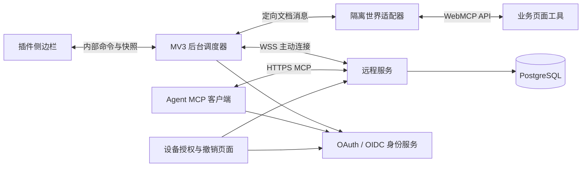

# WebMCP 完整项目实施技术文档

> 文档日期：2026-09-17  
> 状态：首轮本地插件已实现；完整远程项目尚未开发或部署。  
> 首轮交付范围、安装步骤及实测证据见 [README](./README.md) 与 [测试报告](./docs/test-report.md)。本文其余章节保留完整项目的目标设计。  
> 技术选型更新：正式项目 UI 改用 Vue 3 + TypeScript + Vite；既有 HTML 原型继续作为视觉与交互参考。  
> 界面依据：[HTML 原型](./webmcp-extension-prototype.html)。当前桥接协议见：[桥接契约](./docs/bridge-protocol.md)。

## 1. 目标、范围与完成标准

将现有离线原型实现为可安装的 Chrome 插件，发现业务页面实际注册的 WebMCP 工具，支持手动执行，并在用户明确授权后，通过远程 MCP 服务供 Agent 调用。

用户安装插件后不需要启动本地网关。手动模式无需平台账号；远程模式需要平台登录、在线浏览器、页面与工具授权，以及 Agent 的设备访问授权。

### 1.1 交付组成

| 组成 | 必须交付的能力 |
| --- | --- |
| 浏览器插件 | 原型中的工具首页、工具详情、会话记录、连接设置、页面共享，全部连接真实状态 |
| WebMCP 适配层 | 能力探测、顶层页面工具发现、变化监听、执行、原始结果保留 |
| 插件后台 | 页面实例管理、统一调度、访问校验、会话恢复、远程连接 |
| 远程服务 | HTTPS MCP 接口、WSS 设备连接、身份与授权校验、目录与调用路由 |
| 必要授权页面 | 复用身份服务登录页；提供 Agent 设备选择、查看与撤销授权页面 |
| 数据与运维 | 数据库迁移、部署配置、健康检查、日志脱敏、审计清理、兼容性记录 |
| 开发验证 | 自动化测试、仅供测试的工具注册 fixture、真实业务页面联调记录、插件安装包 |

授权页面是完整远程链路需要的真实产品界面，不制作展示工作台、模拟订单页或完整运营后台。测试 fixture 仅进入测试目录，不进入生产插件界面。

### 1.2 第一版边界

- 仅支持经过实测的 Chrome 环境、HTTP/HTTPS 业务页面、顶层文档及不跨文档导航的工具。
- 不支持 iframe 工具、弹出新标签页获取结果、跨页表单工具、任意 JavaScript 执行和 DOM 通用操作工具。
- 不自动生成复杂 Schema 表单，不做批量用例编排、多租户团队管理和服务多实例调度。
- 不将订单字段或人员、部门 ID 生成逻辑写入插件或服务端。三个订单工具仅是首个验收项目。
- 不将“页面返回”“已提交”“业务完成”视为同一状态。

**完整项目验收底线：**真实页面手动调用成功；至少一个实际目标 Agent 完成 OAuth 与设备授权后远程调用成功；撤权、断线、导航和同名工具隔离均通过；没有模拟登录、固定订单结果或定时器模拟执行留在生产路径。

## 2. 从原型到正式项目

### 2.1 界面迁移映射

| 原型界面或行为 | 正式实现 |
| --- | --- |
| 固定订单页面名称和域名 | 当前窗口活动标签页信息，完整 URL 仅在本地使用 |
| 固定 `tools` 数组 | 适配层返回的工具快照；未知描述按普通文本显示 |
| 点击执行后延迟返回假数据 | 后台调度器执行页面 WebMCP API，等待匹配 callId 的响应 |
| 全局 `state` 保存所有内容 | UI 仅持有视图状态；后台维护调用、页面、连接和授权状态 |
| 原型内存记录 | 插件浏览器会话记录，关闭侧边栏后重新打开可恢复 |
| 模拟登录 | 使用 `chrome.identity.launchWebAuthFlow` 完成真实授权码登录 |
| 连接开关 | 启停后台 WSS 连接，不能只修改显示文字 |
| MCP 占位地址 | 从部署配置读取规范化真实资源地址，复制时不包含凭证 |
| 页面共享开关 | 更新后台当前文档授权并同步远程目录 |
| 逐工具勾选 | 与工具注册身份、目录版本关联的显式授权 |
| HTML 刷新清空全部状态 | 正式版区分“刷新侧边栏”与“刷新业务文档”，后者使页面授权失效 |

保留原型的中文、浅色、蓝色强调色和紧凑侧边栏，使用 Vue 3 组件重新实现视图与交互。正式插件铺满浏览器提供的侧边栏宽度，去除网页预览专用的居中外壳、桌面外边距和装饰阴影；按 360px、420px 及可调整宽度验证。

### 2.2 Vue 3 前端与扩展 CSP

正式插件侧边栏和必要的账号授权页面统一采用 **Vue 3 + TypeScript + Vite + `@vitejs/plugin-vue`**。组件使用 Composition API 和 `<script setup lang="ts">`，不使用 Options API。保留原型 CSS 设计变量与布局，不默认引入大型 UI 组件库。

Vue 3 负责界面渲染，不替代插件后台、WebMCP 适配器或远程服务。后台 service worker、content script 和共享协议使用普通 TypeScript 模块，不导入 Vue，也不依赖 DOM。原型的“纯 HTML”要求仅保留在现有原型交付中，正式项目以前述 Vue 3 选型为准。

Vue 单文件组件的模板在构建时编译，生产包只使用 runtime-only Vue，不包含浏览器端模板编译器，不调用 `compile()`，不使用运行时 `template` 字符串。Vite + Vue 官方工具链支持 SFC 预编译和 runtime-only 构建。[Vue 工具链说明](https://vuejs.org/guide/scaling-up/tooling.html)

正式扩展的 `sidepanel.html` 只承载应用挂载节点与包内脚本入口；Vue、业务脚本、CSS 和 SVG 均打包到扩展本地。禁止 CDN、远程脚本、`eval`、`new Function`、原生 HTML 内联事件以及下载代码后执行。SFC 中的 `@click` 会被预编译，不等同于 HTML 的 `onclick` 内联脚本。不得通过放宽 CSP 启用运行时模板编译。Chrome MV3 默认禁止内联 JavaScript，且不能通过 `unsafe-eval` 放宽扩展页面策略。[Chrome 扩展 CSP](https://developer.chrome.com/docs/extensions/reference/manifest/content-security-policy)

正式项目使用 npm 管理依赖、检查、测试与构建。Vue 及 Vite 版本在阶段 A 锁定；最终用户只安装编译后的扩展，不安装 Node.js。服务端继续使用 Node.js 和 PostgreSQL。

### 2.3 Vue 组件与状态边界

根组件 `App.vue` 只负责布局、视图切换和注入后台连接上下文；不把工具列表、参数编辑、授权和连接逻辑集中到一个大组件。第一版侧边栏使用类型化视图状态与返回栈，无外部深链接需求，不引入 Vue Router；各视图刷新后从后台重新获取真实快照。

| 组件 | 职责与主要 props / emits |
| --- | --- |
| `PageStatusCard` | 接收 page、discoveryState；发出 rediscover、requestPermission |
| `ToolList` / `ToolCard` | 接收 tools、grants；发出 selectTool，使用稳定工具标识作为 key |
| `ToolDetailView` | 编排当前工具、参数编辑和对应调用结果，不直接调用页面 API |
| `JsonArgumentEditor` | 接收 schema、modelValue、validation、busy；发出 update:modelValue、fillExample、validate、execute |
| `CallResultPanel` | 接收按 callId 关联的只读记录；通过转义插值展示结果 |
| `SessionHistoryView` | 接收 records，维护来源筛选，发出 selectCall |
| `ConnectionSettingsView` | 接收 connection、account、device；发出 login、logout、connect、disconnect、saveDevice |
| `PageSharingView` | 接收 page、tools、grants、connection；发出 setSharing、setToolGrant |

组件输入使用类型化 `defineProps`，动作使用 `defineEmits`；只有编辑草稿等真正双向数据采用 `v-model`。组件样式采用 `<style scoped>`，全局 tokens、字体与 reset 放在单独 CSS 中。

状态归属和复用逻辑固定如下：

- `useExtensionBridge`：每个侧边栏实例在根级创建一次 runtime Port，提供只读后台快照和类型化命令方法，通过带类型的 provide/inject 下发；重连只重新订阅快照，不重发执行命令。
- `useToolDrafts`：按文档实例、工具标识和目录版本保存 UI 参数草稿；切换工具不覆盖别的草稿，文档或契约变化后旧草稿不自动用于新工具执行。UI 关闭后的草稿恢复不作为第一版承诺。
- `usePanelNavigation`：维护本侧边栏视图与返回栈；跳转后处理标题焦点，后台更新不强制跳转或抢夺输入焦点。
- `useCallHistory`：从后台快照派生来源筛选和当前调用记录，不另建一份可变执行状态。
- 远程连接、执行锁、真实调用记录和授权均由后台唯一管理。UI 发出命令后以后台确认更新正式状态，等待期间禁用重复操作，不能先显示为已连接或已授权。
- 使用 `computed` 派生计数、筛选、可执行状态；大结果与后台快照使用 `shallowRef` 接收不可变替换，避免对任意业务结果深层代理。卸载时清理 Port 监听与 UI 副作用，但不取消后台业务调用。

第一版不引入 Pinia，使用上述根级共享 composable 与显式依赖注入即可；更不能用 Pinia 或其他 UI store 代替 worker 的权威状态。Vue 响应式对象不直接跨 runtime 消息传递，命令由普通、可序列化的数据对象构造。

工具名称、描述、Schema 和结果使用 Vue 转义插值或文本节点，禁止 `v-html`。原型拼接 HTML 字符串的渲染函数改为 `.vue` 模板，不整体复制到组件中的 `innerHTML`。

## 3. 技术选型与目录

### 3.1 实施选型

| 层 | 选择 | 实施要求 |
| --- | --- | --- |
| 插件 UI | Manifest V3、Vue 3 SFC、TypeScript | 使用 Side Panel、Composition API，不另建 popup 工作台 |
| 插件后台与适配器 | TypeScript ES Modules | 不依赖 Vue；按 worker 与 content script 执行环境分别构建 |
| 授权页面 | Vue 3 + TypeScript | 独立 Web 应用，复用视觉规范，不导入 Chrome 扩展 API |
| 服务端与协议 | Node.js 受支持 LTS、TypeScript | 单实例；版本在首次构建时锁定并记录 |
| HTTP / WebSocket | Express、ws | 同一进程承载 API、MCP 与设备连接 |
| MCP | 官方 TypeScript SDK v2 稳定线 | 使用对应 v2 文档，不复制 v1 的包名和导入路径 |
| 数据库 | PostgreSQL、SQL migration、pg | 参数化查询；在线页面不写成永久目录 |
| Schema | CSP 兼容的解释式 JSON Schema 校验器 | 初选 `jsonschema`；按第 7 节验证通过后锁版本 |
| 身份系统 | 成熟 OAuth/OIDC 授权服务 | 接入配置化，必须通过 MCP 兼容验证；不自建密码系统 |
| 构建与测试 | npm workspaces、Vite、@vitejs/plugin-vue、esbuild、vue-tsc、Vitest、Vue Test Utils | UI 使用 Vite；worker/content 使用独立 esbuild 任务；另做真实浏览器集成测试 |
| 部署 | 容器 + TLS 反向代理 | 第一版一个应用实例与一个 PostgreSQL 服务 |

调研时官方 SDK 主线说明 v2 是稳定发布线，并使用 `@modelcontextprotocol/server`、`@modelcontextprotocol/client` 等拆分包；本项目以此为候选基线。实际补丁版本、协议协商和目标 Agent 兼容结果必须写入锁文件及兼容性记录，不能将“最新”作为发布约束。[官方 TypeScript SDK](https://github.com/modelcontextprotocol/typescript-sdk)

### 3.2 目标目录

```text
webmcp-extension/
├── webmcp-extension-prototype.html
├── webmcp-extension-implementation.md
├── package.json
├── package-lock.json
├── apps/
│   ├── extension/
│   │   ├── manifest.json
│   │   ├── sidepanel.html
│   │   ├── assets/
│   │   ├── vite.config.ts
│   │   └── src/
│   │       ├── ui/              # main.ts、App.vue、views、components、composables、styles
│   │       ├── background/      # worker、页面仓库、调度器、连接与登录
│   │       └── content/         # 隔离世界中的 WebMCP 适配入口
│   ├── server/
│   │   └── src/                 # HTTP、MCP、WS、认证、授权、审计
│   └── account/
│       ├── index.html
│       ├── vite.config.ts
│       └── src/                 # Vue 设备授权及撤销页面、同源 API 客户端
├── packages/
│   ├── protocol/                # 类型、运行时消息校验、错误码
│   └── schema-validation/       # 前后台共享的参数校验规则
├── migrations/
├── tests/
│   ├── unit/
│   ├── integration/
│   ├── extension/
│   └── fixtures/                # 测试专用页面，不进入生产安装包
├── deploy/                      # Dockerfile、compose、代理配置、环境变量示例
├── scripts/                     # 构建、打包、迁移、校验
└── docs/                        # 安装、部署、兼容性、项目接入、验收记录
```

`dist/extension/` 为可加载的解压扩展，`dist/server/` 为服务端编译结果。打包产物包含所需校验依赖，不依赖运行时下载。`dist/account/` 为授权页面构建产物，由服务端同源提供。

### 3.3 构建与运行约束

- UI 使用 Vite 构建 `sidepanel.html`，配置相对资源路径 `base: './'`，SFC 模板在构建期编译；Vue 和资源均打入本地包，不外置到 CDN。
- worker 使用独立 esbuild 任务输出固定文件名 `background.js`，格式为 ESM，manifest 设置 `background.type: "module"`；第一版打为单入口，不依赖动态 import。
- content script 独立打成固定文件名 `content.js` 的单个 IIFE 包，不含顶层 ESM import、Vue、HMR 或页面端加载器，便于 `chrome.scripting` 注入。
- 根构建脚本先构建 UI，再构建 worker/content，最后复制 manifest 与图标，检查引用路径均存在；只有首次任务清空输出目录，避免后续构建互相删除产物。
- 开发真实插件使用本地构建 watch 和扩展重载，不将 Vite HMR 地址、开发脚本或远程源加入生产 CSP。独立 UI 单元测试可注入 mock bridge，但 mock 不进入生产包。
- 账号页面单独构建与部署，基础路径固定为 `/account/`；内部视图使用受控状态，OAuth 回调由服务端处理，不依赖前端 history 路由回退。
- `npm run check` 分别执行 UI 的 `vue-tsc --noEmit` 和后台、适配器、服务端的 `tsc --noEmit`。Vite 能编译 TypeScript 不代表已经完成类型检查。[Vue TypeScript 说明](https://vuejs.org/guide/typescript/overview.html)

## 4. 系统架构与边界



手动链路在浏览器内部闭环，参数和结果不发往服务端。远程链路经过服务端，但默认只持久化审计元数据。

侧边栏不直接执行工具；页面适配器不持有账号凭证；服务端不直接操作 DOM；业务页面不需要插件专属 SDK。应用内部的 `pageId`、调用信息和协议元数据由平台生成，不采用页面上报值作为权限依据。

## 5. 插件权限与页面生命周期

### 5.1 Manifest 与最小权限

基础权限采用 `sidePanel`、`activeTab`、`scripting`、`storage`、`webNavigation`、`identity`、`alarms`。每项权限需在安装说明中说明用途：

- `sidePanel`：承载侧边栏；使用 action 点击打开。
- `activeTab`、`scripting`：用户触发后访问当前页、注入包内适配脚本。
- `storage`：设置与浏览器会话快照。
- `webNavigation`：顶层文档提交、同文档导航和失效处理。
- `identity`：浏览器扩展登录回调。
- `alarms`：重连唤醒辅助，不作为业务执行计时的唯一依据。

业务站点使用 `optional_host_permissions` 声明 HTTP/HTTPS 范围，仅在用户操作中申请当前 origin。服务域名作为构建配置写入必要的 host permission 和 CSP 连接白名单。不得安装时请求全部网站永久访问、Cookie、调试器或任意文件访问。

权限提示出现前显示实际站点；拒绝时显示 `permission_required`。`chrome://`、扩展商店及不能注入的受限页面显示 `restricted_page`，不得反复要求授权。

Side Panel 在 Chrome MV3 提供官方 API；其可用版本不等于 WebMCP 可用版本，两者必须分别验证。[Side Panel 文档](https://developer.chrome.com/docs/extensions/reference/api/sidePanel)

### 5.2 文档身份

后台使用 `(browserSessionId, tabId, frameId=0, documentId)` 定位真实文档。通过 Chrome 提供的发送者和导航事件确定身份，不信任消息体自报的 tabId/documentId。

- 新文档生成随机本地页面实例 ID；远程服务登记后分配对外不透明 pageId。
- 调用携带页面实例与目录版本，定向发送到匹配文档，不能仅按 tabId 发送到新页面。
- 普通刷新、跨文档导航、标签页关闭：旧页面下线、授权失效、未完成调用进入拒绝或未知状态。
- SPA 路由变化：重新发现工具、重新核对授权；第一版采用保守策略，清除当前页面共享与工具授权，提示重新授权。
- 工具注销或重新注册：更新目录版本并撤销该工具授权。无法判定具体变化时清除全部工具授权。
- 活动标签页切换：UI 切换到对应文档快照，不取消后台已发出的调用，不自动共享新标签页。
- 后台失去执行追踪能力：该文档保持“执行状态待核实”，不得仅因超时释放执行锁并允许第二次操作；见第 8 节。

上传用于展示的地址保留 origin/pathname，删除 query、fragment、用户名和密码。不以 URL 字符串相同判定授权仍有效。

## 6. WebMCP 适配与兼容验证

### 6.1 首个开发关卡

必须先在目标 Chrome 上验证发现和执行接口，再开发完整远程链路。版本记录至少包括 Chrome 完整版本、系统、实验开关、扩展版本、API 形态、是否需要额外权限、支持的工具类型及测试日期。

调研时 Inspector 源码使用 `document.modelContext.getTools()`、`executeTool(tool, arguments)` 和工具变化通知，工具描述包含 `inputSchema`。参考 manifest 声明了特定最低 Chrome 版本，但不是本项目已实测的版本承诺。[Inspector 适配参考](https://raw.githubusercontent.com/beaufortfrancois/model-context-tool-inspector/main/content.js)、[参考 manifest](https://raw.githubusercontent.com/beaufortfrancois/model-context-tool-inspector/main/manifest.json)

第一版优先在隔离世界 content script 内访问经过验证的浏览器接口，不覆写页面 `registerTool`，不添加通用 MAIN 世界执行桥。不支持该访问方式的环境显示不兼容；如确需其他适配策略，单独验证后再扩展。

### 6.2 统一适配契约

```ts
interface PageTool {
  name: string;
  description: string;
  inputSchema: Record<string, unknown>;
  annotations?: Record<string, unknown>;
  executable: boolean;
  unavailableReason?: string;
}
interface WebMcpAdapter {
  probe(): Promise<{ supported: boolean; reason?: string }>;
  discover(): Promise<PageTool[]>;
  subscribe(onChange: () => void): () => void;
  execute(name: string, args: Record<string, unknown>): Promise<unknown>;
}
```

真实浏览器 tool 对象及不可序列化引用只留在适配器中。后台传工具名，适配器以当前目录查找对应引用，不将页面传入的代码或函数转发执行。

API 调用签名在兼容性阶段固定，执行阶段不通过“失败后换参数格式再调用”试探能力，防止已执行工具被重复调用。明确排除非顶层窗口工具和已知跨文档导航工具；未能预判的导航由生命周期机制中止追踪并报告未知。

能力探测至少分别返回：`unsupported`、`permission_required`、`restricted_page`、`ready_empty`、`ready`、`discovery_failed`。发现失败与调用失败分开处理。

## 7. 参数校验与结果渲染

原型的小型校验函数仅覆盖示例，不进入正式项目。生产 Schema 校验模块由插件和服务端共享，同一输入必须得到一致结论。

第一版统一接受 JSON Schema draft-07；未声明 `$schema` 时按 draft-07 解释。必须覆盖对象、数组、required、additionalProperties、enum、const、数值与长度约束、oneOf/anyOf/allOf/not、条件及本地 `$ref`。显式其他方言、无法解析的引用或未知约束关键词返回 `SCHEMA_UNSUPPORTED`，工具可查看但不可执行，不静默跳过。`format` 在第一版作为注解，不承诺语义校验，并在兼容性说明中注明。

优先验证解释式 `jsonschema` 的浏览器 bundle、CSP 和上述用例；扩展中不得运行动态生成代码的校验器。对任意动态页面 Schema，不能以构建时预编译示例 Schema 冒充支持。[候选校验器源码](https://github.com/tdegrunt/jsonschema)

校验不修改输入，不隐式应用 default，不自动删除额外字段，不强制转换类型。点击“填入默认示例”才生成 JSON：采用明确 default；未提供的必填字段生成类型提示模板并标示待填写；oneOf 多分支不擅自选择，提示用户按 Schema 编辑。生成示例不保证可通过业务校验。

Schema 本身是不可信输入：限制单工具 Schema 为 128 KiB、嵌套深度 32、每文档 200 个工具，不允许远程 `$ref` 网络获取。定义和测试正则及递归消耗限制；不能可靠约束的 Schema 标记不支持，不能使后台卡死。必要时在可终止的扩展校验上下文运行，并设置 500ms 校验预算；后台收到校验失败或超时不得执行。

参数上限 256 KiB、单次结果上限 1 MiB，以 UTF-8 序列化字节计量。此处业务结果上限不包括 MCP 信封，HTTP/WS 总包上限须留出信封和转义空间，例如 4 MiB。不可 JSON 序列化的值返回 `RESULT_UNSERIALIZABLE`；超限返回 `RESULT_TOO_LARGE`，均不能标为业务成功。

结果只通过 Vue 转义插值、`textContent` 或文本节点渲染，禁止 `v-html`。保留原始字符串与结构，不尝试执行 HTML，不依据结果文本中的“成功”猜测业务状态。

## 8. 调度、调用状态与恢复

### 8.1 单一调度入口

```ts
type InvokeRequest = {
  requestId: string;
  pageId: string;
  catalogVersion: string;
  toolName: string;
  arguments: Record<string, unknown>;
};
```

手动请求来自可信侧边栏，Agent 请求来自已认证远程连接。来源由消息通道确定，不允许请求体自行声明为手动从而绕过授权。

执行流程：身份与来源校验 → 页面实例检查 → 目录版本与工具检查 → 参数校验 → 原子获取文档执行锁 → 再核验权限与版本 → 写入调用记录 → 发给对应适配器 → 接收响应 → 更新状态与 UI → 返回远程结果。失败时不静默排队。

### 8.2 状态分层

```ts
type Delivery = 'not_sent' | 'sent' | 'acknowledged';
type Execution = 'running' | 'returned' | 'rejected' | 'unknown';
type Business = 'unclassified' | 'error';
type CallRecord = {
  callId: string;
  pageId: string;
  catalogVersion: string;
  toolName: string;
  source: 'manual' | 'agent';
  delivery: Delivery;
  execution: Execution;
  business: Business;
  startedAt: string;
  durationMs?: number;
  errorCode?: string;
  arguments?: Record<string, unknown>;
  rawResult?: unknown;
};
```

- 已返回：确实取得页面结果；明确受支持结果结构中的 `isError: true` 标注业务错误。
- 未发送拒绝：可证明未调用页面，例如校验失败、无权限、旧目录、页面繁忙。
- 结果未知：已发送或不能证明未送达，但超时、断连、导航或后台重启导致没有最终结果。
- 取消等待不等于业务取消；仅实际 API 明确确认终止后才能声称已取消。

### 8.3 超时与锁

调用截止时间默认 60 秒，保存绝对截止时间并在每次事件处理时核验。服务端等待与反向代理超时高于该值，建议 75 秒和 90 秒；不能仅依赖 MV3 worker 的定时器。

到期可结束等待并向调用方返回未知，但执行锁不因此自动释放。若适配器还能追踪原 Promise，等其 settled 后解除锁；不能追踪时保持文档阻塞，提示用户核实业务状态后刷新页面。新文档产生新锁和新授权。晚到结果可以更新本地历史的“后续已返回”，不得重新回复已经结束的 MCP 请求。

同一连接会话重复收到同一 callId 时不再次执行；返回已记录状态。去重记录在该连接会话内保留，达到上限时停止接收新调用而不是淘汰仍可能重复执行的标识。重连不重发旧业务请求。服务重启后旧会话标识失效，不承诺跨重启的 exactly-once。

### 8.4 会话存储

- `storage.local`：设备 ID、设备名称、用户主动连接偏好、非敏感设置；不存业务参数和结果。
- `storage.session`：受限访问的登录会话材料、页面与执行状态快照、会话历史；仅可信扩展上下文可读。
- content script：实际 Promise 与工具引用，不得读取凭证。
- 会话历史默认最多 100 条且总预算 6 MiB；达到限制时优先移除最旧已完成记录的完整载荷，保留元数据并显示“结果已释放”，不影响当前调用真实返回。
- 浏览器重启、扩展重新加载或禁用后要求重新登录、重新共享；侧边栏关闭不清除后台状态。
- worker 重启先恢复快照，再核验实际文档与适配器状态；不能确认的在途调用记为未知并保留阻塞标识。

Chrome 的 session storage 有会话和配额语义，不能将其当作无限内存或长期安全保险库。[Storage 文档](https://developer.chrome.com/docs/extensions/reference/api/storage)

## 9. 内部消息与 WSS 协议

### 9.1 插件内部

侧边栏通过 runtime Port 订阅后台快照，命令通过带 requestId 的结构化消息发送。Port 断开只取消订阅，不关闭连接或取消调用。后台验证扩展 ID、发送者页面路径及命令白名单，content script 不能发送登录、授权修改等控制命令。

命令包括 `GET_SNAPSHOT`、`DISCOVER`、`INVOKE`、`SET_PAGE_SHARING`、`SET_TOOL_GRANT`、`CONNECT`、`DISCONNECT`、`LOGIN`、`LOGOUT`。结果包括 `SNAPSHOT`、`CATALOG_CHANGED`、`CALL_UPDATED`、`CONNECTION_CHANGED`、`COMMAND_ERROR`。

所有命令均需运行时结构校验和长度限制，不能仅依赖 TypeScript。

### 9.2 远程消息信封

```ts
type Envelope = {
  protocolVersion: 1;
  type: string;
  messageId: string;
  connectionEpoch?: string; // 认证后由服务端分配
  callId?: string;
  payload: unknown;
};
```

消息类型：`AUTH`、`AUTH_OK`、`CATALOG_SNAPSHOT`、`CATALOG_ACK`、`PAGE_REMOVE`、`CALL_REQUEST`、`CALL_ACK`、`CALL_RESULT`、`CANCEL_REQUEST`、`CANCEL_RESULT`、`PING`、`PONG`、`ERROR`。

- AUTH 携带 HTTPS 获取的一次性票据；票据 30 秒有效、原子消费、绑定用户和设备，不放在 WS URL。
- 未认证连接 5 秒内必须认证，否则关闭；认证前不接受目录和调用。
- 首次认证后全量同步授权目录，服务端确认后页面才显示远程可用。
- 每 20 秒发送应用层心跳，60 秒无响应断线。连接状态由实际事件推进，不凭开关位置显示在线。
- 重连采用带抖动的 1、2、4、8、16、30 秒上限退避；用户主动断开、退出、设备撤销时停止重连。
- 重连生成新 epoch，旧 epoch 的消息拒绝。旧 epoch 页面从服务目录删除，再登记新目录与对外 pageId。
- 工具目录变化使用版本化全量快照，忽略乱序旧版本；撤权先在插件本地生效，服务端收到更新后移除可见工具。
- 用户恢复连接后可恢复同一真实文档上尚有效的显式授权；不恢复已刷新或已注销工具的授权。

活动 WebSocket 消息可改善扩展 worker 存活，但不保证永久在线，断线与状态恢复仍是必要逻辑。[Chrome WebSocket 指南](https://developer.chrome.com/docs/extensions/how-to/web-platform/websockets)

## 10. MCP 与 HTTP 接口

### 10.1 对外 MCP 工具

使用 HTTPS Streamable HTTP，统一地址为部署后的 `/mcp`，由官方 SDK 处理初始化、版本协商、工具调用、响应封装和取消通知。不要自己实现一套“类似 MCP”的 JSON REST 接口替代。

| 工具 | 输入 | 输出 |
| --- | --- | --- |
| `list_webmcp_pages` | `{}` | 当前用户、当前 OAuth client 有权访问且已同步的在线页面 |
| `list_webmcp_tools` | `{ pageId }` | 允许调用的工具名称、描述、完整 inputSchema、catalogVersion |
| `call_webmcp_tool` | `{ pageId, catalogVersion, toolName, arguments }` | callId、传输执行状态、业务标记、原始结果及耗时 |

pageId 对应用户、设备、当前文档、当前服务连接会话。列表不得泄露其他账号的页面或未共享工具名称。无权限目标统一返回不可访问，不提供跨用户存在性线索。

示例业务返回包装：

```json
{
  "callId": "generated-call-id",
  "execution": "returned",
  "business": "unclassified",
  "durationMs": 812,
  "rawResult": { "status": "submitted" }
}
```

包装作为 MCP 工具结果内容返回。基础协议错误采用 SDK 的协议错误处理；业务不可执行、权限失效、超时或原始明确业务错误采用 MCP 工具错误结果，并携带稳定错误码。原始结果始终保留，不把业务工具响应伪装为平台指令。

### 10.2 业务 API

下表仅定义应用接口，OAuth authorize/token/discovery 端点由选定身份服务提供并遵循其标准元数据。

| 方法与路径 | 用途 | 身份要求 |
| --- | --- | --- |
| `POST /api/devices` | 注册当前插件设备，返回 deviceId | 插件 access token |
| `PATCH /api/devices/:id` | 修改本人设备名称 | 插件或账号页面会话 |
| `GET /api/devices` | 列出本人可授权设备及在线状态 | 账号页面会话 |
| `DELETE /api/devices/:id` | 撤销本人设备并关闭连接 | 账号页面会话 |
| `POST /api/ws-tickets` | 为本人设备签发一次性 WS 票据 | 插件 access token |
| `GET /api/agent-grants` | 查询本人 Agent 设备授权 | 账号页面会话 |
| `PUT /api/agent-grants/:clientId` | 替换该 client 的设备授权集合 | 账号页面会话、有效授权事务 |
| `DELETE /api/agent-grants/:clientId` | 撤销该 client 的设备访问 | 账号页面会话 |
| `GET /health/live` | 进程存活 | 无业务数据 |
| `GET /health/ready` | 数据库、迁移及必要认证配置就绪 | 无凭证输出 |

请求仅接受限定字段；设备名称 1–60 个字符，空白规范化后检查；ID 不作为所有权证明。所有写入校验当前主体和目标关系。Cookie 认证接口需要 CSRF 防护及 Origin 检查；Bearer 接口限制受众和 scope。错误使用 `{ code, message, requestId }`，禁止包含令牌和业务结果。

### 10.3 错误码

| 错误码 | 含义 | 用户或 Agent 后续动作 |
| --- | --- | --- |
| `WEBMCP_UNSUPPORTED` | 浏览器能力不满足 | 查看已验证兼容环境 |
| `SITE_PERMISSION_REQUIRED` | 站点权限缺失 | 用户主动授予权限 |
| `PAGE_UNAVAILABLE` | 页面离线或当前主体不可访问 | 重新发现页面 |
| `CATALOG_STALE` | 调用目录版本失效 | 重新获取工具目录 |
| `TOOL_UNAVAILABLE` | 工具消失或不可执行 | 重新发现，不盲目重试 |
| `SCHEMA_UNSUPPORTED` | Schema 无法可靠校验 | 调整契约或扩展支持 |
| `INVALID_ARGUMENTS` | 参数不符合 Schema | 修正参数 |
| `PAGE_BUSY` | 文档已有执行或执行状态待核实 | 等待完成或核实业务 |
| `GRANT_REVOKED` | 权限被撤销 | 用户重新授权 |
| `EXECUTION_UNKNOWN` | 无法确认最终结果 | 核实业务后决定下一步 |
| `RESULT_TOO_LARGE` | 已执行但返回超限 | 收窄工具结果，不能自动重放 |
| `RESULT_UNSERIALIZABLE` | 结果无法规范传输 | 修正业务工具返回结构 |

## 11. 登录、设备和 Agent 授权

### 11.1 插件登录

使用授权码流程和 PKCE S256。插件属于 public client，不能嵌入 client secret。回调 URI 通过 `chrome.identity.getRedirectURL()` 获取并精确注册；校验 state、issuer 和重定向结果后换取 token。[Chrome Identity API](https://developer.chrome.com/docs/extensions/reference/api/identity)

插件 token 受众限定为设备管理 API，scope 为设备注册、当前设备票据签发等，不直接授予 Agent 的 MCP 调用权限。token 保存在 trusted extension 的会话存储，日志与页面脚本不可见。会话过期尝试一次规范刷新，失败转未登录；退出清理本地授权、关闭连接、撤销服务端对应会话。

### 11.2 Agent 授权与设备选择

远程 MCP 作为 OAuth resource server，发布规范的 Protected Resource Metadata；身份服务发布授权元数据，使用资源受众、scope、PKCE 和 token 校验。2026-07-28 规范明确了资源参数及 issuer 校验等要求，实施必须采用同一协议基线验证。[MCP 授权规范](https://modelcontextprotocol.io/specification/2026-07-28/basic/authorization)

第一版采用**预注册目标 Agent client**，限制为完成兼容验证的客户端；暂不开放任意动态注册。不接受界面手工填写 Agent 名称来建立可信身份。

设备选择页与身份服务的授权事务集成：

1. Agent 请求 MCP，按照资源元数据进入身份服务授权流程。
2. 用户登录，身份服务产生服务端保存的短时授权事务，包含真实 userId、clientId、resource、scope 和回调关联信息。
3. 设备选择页只接收事务句柄，不接收可直接信任的 userId/clientId 查询参数；展示数据库中该用户的设备。
4. 用户明确选择后，服务端保存 `(userId, clientId, deviceId)` 授权关系，再恢复身份服务流程并由身份服务签发授权码。
5. MCP 每次请求验证 access token 的 issuer、audience、有效期、scope 与已验证 client 身份，再查询设备授权；不能仅凭一个有效用户 token 开放所有设备。
6. 授权页面可查看和撤销既有设备关系。撤销立即影响新调用，插件侧页面授权不能扩大 Agent 已获的设备范围。

身份服务必须提供可信授权事务/同意页面扩展能力，以及可验证的 client 身份 claim 或 introspection 信息。若团队现有服务不具备这些能力，需要在认证阶段更换成熟提供方或完成其支持的扩展；不能通过伪造 OAuth 回调、自己签临时通用 token 或手填 clientId 绕过。

最终调用条件为：身份有效 ∩ OAuth scope ∩ Agent 设备授权 ∩ 设备在线 ∩ 当前文档共享 ∩ 当前工具授权 ∩ 当前目录版本有效。

## 12. 数据模型与保留

| 表 | 核心字段 | 约束 |
| --- | --- | --- |
| `users` | id、issuer、subject、display_name、created_at | issuer + subject 唯一，不以邮箱作为身份主键 |
| `devices` | id、user_id、name、created_at、revoked_at、last_seen_at | 外键关联用户，所有修改检查所有权 |
| `agent_device_grants` | user_id、client_id、device_id、created_at、revoked_at | 三元组唯一；服务端每次调用查询有效关系 |
| `audit_calls` | call_id、user_id、client_id、device_id、tool_name、started_at、duration_ms、delivery、execution、error_code | 不存完整参数、Schema 和业务结果，默认保留 7 天 |
| `auth_transactions` | id_hash、user_id、client_id、provider_ref、expires_at、consumed_at | 短时、单次使用；避免持久化明文授权码或票据 |

在线连接、页面目录、待执行调用和一次性 WS 票据在单实例内存中保存。服务重启后全部失效，插件重新认证登记。设备存在于数据库不等于设备在线。

手动调用不上报远程审计。远程审计按 TTL 定时清理，并提供幂等任务；记录清理失败指标。工具描述和 URL 可能含业务信息，服务端日志不自动输出原始目录。完整结果调试保存不进入第一版，未来单独增加显式授权和清理策略。

索引至少覆盖用户设备查询、有效授权查找、审计时间清理；迁移采用版本表和事务，失败不启动可接流量的服务。

## 13. 开发、部署与运维

### 13.1 预期开发命令契约

以下命令由后续代码实现，当前目录尚不存在对应脚本，不能视为已经可以运行。

```sh
npm ci
npm run check
npm test
npm run build
npm run db:migrate
npm run dev:server
npm run dev:extension
npm run test:ui
npm run test:integration
npm run test:extension
npm run package:extension
```

`dev:extension` 启动扩展各入口的本地构建 watch；`test:ui` 使用 Vitest + Vue Test Utils 检查组件与 bridge 生命周期。以上命令仍是后续实现契约。

开发人员通过 Chrome 扩展管理页加载 `dist/extension/`。本地测试 fixture 仅供验证真实 WebMCP API，不向普通用户提供展示页面。真实业务验收使用现有 provider-web 环境。

### 13.2 配置清单

| 配置 | 用途 |
| --- | --- |
| `PUBLIC_ORIGIN`、`MCP_RESOURCE_URI` | 对外服务 origin 与精确 MCP 资源 URI |
| `DATABASE_URL` | PostgreSQL 连接，通过 secret 注入 |
| `OIDC_ISSUER` | 可信身份服务 issuer，不接受请求端自由传入 |
| `EXTENSION_CLIENT_ID` | 扩展 public client 标识 |
| `ACCOUNT_CLIENT_ID`、`ACCOUNT_CLIENT_SECRET` | 服务端账号页面登录客户端，secret 仅服务端 |
| `ALLOWED_AGENT_CLIENT_IDS` | 第一版实测的 Agent client 白名单 |
| `EXTENSION_REDIRECT_URI` | 与实际扩展 ID 对应的回调 URI |
| `PORT`、`TRUST_PROXY` | 监听与可信代理范围 |
| `CALL_TIMEOUT_MS` | 默认 60000 |
| `AUDIT_RETENTION_DAYS` | 默认 7 |
| `LOG_LEVEL` | 默认 info，禁止记录敏感请求体 |

域名、IdP 租户、client 注册、实际 Agent 客户端是部署输入，不预填真实秘密。生产环境禁止 demo bypass；健康检查不得因为数据库可连而忽略认证配置缺失。

### 13.3 生产部署

单应用容器对外提供 `/mcp`、`/ws`、`/api` 和账号页面；反向代理终止 TLS，正确转发 WebSocket Upgrade，并为 MCP 流式响应关闭不适当缓冲。仅应用内网访问数据库。

设置请求体限制、设备连接数限制、每用户调用速率限制、已认证 WS 每连接消息速率限制。认证失败不无限重试。验证 Host、Origin 和受众；MCP 接入校验须遵循 SDK 与所选传输规范，不把 CORS 当认证。

优雅停机停止接收新调用、标记 readiness 失败，限时等待在途调用；无法完成的调用报告未知，不能在重启后重放。第一版不运行多个应用副本。

监控至少包含设备在线数、WS 认证失败、重连频率、目录同步失败、执行耗时、拒绝/未知/业务错误数量、数据库失败与审计清理失败。不按原始页面 URL、工具参数或用户文本创建高基数标签。

## 14. 测试与验收矩阵

| 层级 | 必测场景 | 通过标准 |
| --- | --- | --- |
| 单元 | 参数校验与默认值 | 不变更输入；oneOf、本地引用、未知方言明确处理 |
| 单元 | 权限交集与目录版本 | 任一权限缺失均拒绝，新工具不继承授权 |
| 单元 | 调用状态机 | 超时不宣称未执行、不自动释放不确定执行锁 |
| 插件 | 无支持、无权限、受限页、无工具 | 四种状态有独立文案与正确操作入口 |
| Vue UI | 组件事件、草稿隔离、快照更新、卸载重挂载 | 不重复订阅；后台推送不丢输入焦点；UI 卸载不取消业务；文本转义正确 |
| 插件 | Vue 构建、CSP 与离线手动模式 | 无运行时模板编译、内联执行或动态代码错误；真实扩展加载通过，断开服务也能真实调用 |
| 插件 | 开关侧边栏、切换工具/标签页 | 执行不中断，不串结果，不串文档 |
| 插件 | 刷新、SPA、工具注销重注册 | 旧授权失效，旧文档调用不会送到新文档 |
| 插件 | worker 重启、浏览器重启 | 前者恢复可信会话状态，后者重新登录和共享 |
| 服务 | 固定三个 MCP 工具 | 实际客户端完成初始化、发现、执行与错误处理 |
| 认证 | 错 issuer/audience、过期 token、重复票据 | 全部拒绝，不暴露目标对象信息 |
| 授权 | 两账号、两设备、两个 Agent client | 用户隔离和设备授权关系严格生效 |
| 协议 | 乱序目录、旧 epoch、重复 callId | 不覆盖新目录，不重复执行 |
| 可靠性 | 已发出未 ACK、超时、取消、断网 | 无法证明未执行时统一报告未知 |
| 结果 | isError、submitted、文本、超限、不可序列化 | 原意保留、错误明确、不静默截断成功 |
| 数据 | 日志、会话历史和审计清理 | 无 token/Cookie/完整业务请求体泄露，TTL 生效 |
| UI | 360/420px、长名称、键盘、长 JSON | 无遮挡，焦点可见，滚动和返回路径可用 |

模拟适配器只用于自动化测试；至少一轮扩展测试必须在经验证的 Chrome 与真实 WebMCP 页面执行。至少一个目标 Agent 必须完成实际 OAuth，而不仅是手写 HTTP 请求。

订单项目依次验收 `set_order_list_query`、`select_order_filter_options`、`query_orders`，确认实际页面条件和当前请求结果对应；不固定断言历史订单数量。再使用第二独立项目验证同名工具不会冲突、服务端无需修改业务逻辑。

## 15. 实施顺序与交付检查

| 阶段 | 工作 | 必须通过的出口 |
| --- | --- | --- |
| A | 锁定浏览器 API、SDK/协议、Schema 校验与 IdP 兼容性 | 真实发现与执行样例、CSP 验证、认证兼容记录 |
| B | 按原型实现 Vue 3 插件 UI、权限与发现 | 可加载安装包，五个原型界面由真实后台驱动 |
| C | 手动调度、记录与生命周期 | 无远程服务也可完成业务调用及恢复测试 |
| D | 单实例服务、数据库、WSS 和 MCP | 隔离测试环境完成双向路由，旧目标和重放测试通过 |
| E | 真实登录、设备授权与撤销 | 至少一个 Agent 的完整 OAuth 到业务执行链通过 |
| F | 限制、异常、部署与第二项目 | 测试矩阵、部署说明和安装包齐备，可交付内部使用 |

A 阶段发现不兼容不能以模拟 API 绕过并宣称功能已完成。D 阶段只有测试身份和隔离环境时不能作为对外可用版本。版本发布附兼容性清单、实际测试证据和已知限制。

最终交付清单：插件源码及 ZIP、服务端源码及容器配置、必要授权页面、数据库迁移、依赖锁文件、环境变量示例、安装部署手册、业务接入指南、测试报告、兼容性矩阵。保留原型作为 UI 基线，不覆盖原技术方案。

## 16. 外部输入与明确未验证事项

实施前需要取得：真实 provider-web 测试地址与测试账号、允许使用的 Chrome 环境、平台域名和 TLS、身份服务配置权限、至少一个目标 Agent 的名称与版本、数据库运行环境。

这些属于部署与实测输入，本文没有捏造具体账号、密钥或兼容结果。仓库现已包含首轮本地插件源码和安装包；原型仍使用示例契约与模拟结果，不能作为 MCP 或 OAuth 已经通过验证的证据。本轮浏览器 API 实测组合见兼容性记录。

技术参考核查日期为 2026-09-17。原方案中的旧 MCP 参考版本只代表原有设计来源；正式实施以阶段 A 实测锁定的完整组合为准。上线前重新核查依赖安全更新，但升级后必须重跑兼容与授权测试。
